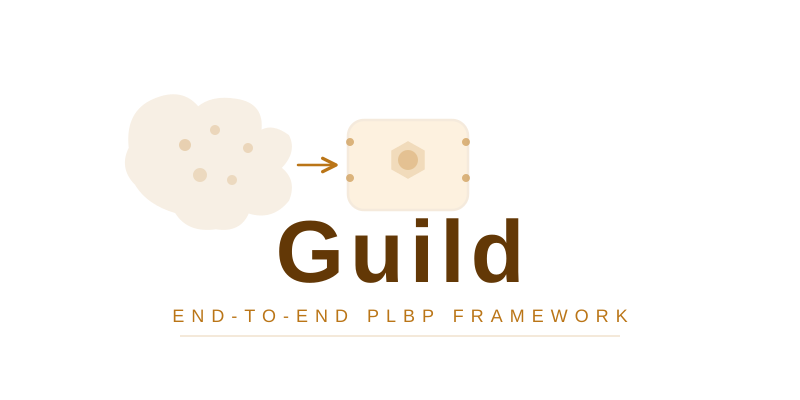

<p align="center">
  
</p>

# Guild

> **Version 1.0.0** — Python ≥3.10, <3.11

Guild is an open-source Protein-Ligand Binding Tools orchestrator that covers the end-to-end pipeline while leveraging multiple docking methods in each step.

## Table of Contents

* [Docker (recommended)](#docker)
* [Running locally](#how-to-run)
* [Installations](#installations)
* [Usage](#usage)
  * [Single run](#single-run)
  * [BulkRun](#bulkrun)
* [Methods](#methods)
  * [Docking](#docking)
  * [Post-analysis](#post-analysis)

## Docker

The recommended way to run Guild is via Docker, which bundles all dependencies (Vina, OpenBabel, LocalColabFold, KarmaDock, DiffDock, Boltz).

### Build the image

```shell
make docker-local
```

### Run docking

All run targets accept the same set of parameters, passed as Make variables.
The local repository is volume-mounted into the container at `/workspace`, so
changes to `guild/` are reflected immediately without rebuilding.

```shell
# All three methods, first 100 rows, batch size 2, with known binders, clean start
make run-guild \
  COMBINATIONS=/workspace/notebooks/data_prep/full_combinations_table.csv \
  METHODS="vina boltz diffdock" \
  HEAD=100 \
  BATCH_SIZE=2 \
  KNOWN_BINDERS=1 \
  CLEAN=1

# Boltz only (GPU)
make run-boltz \
  COMBINATIONS=/workspace/path/to/combos.csv \
  PROJECT=myproject

# Vina only (CPU, no GPU required)
make run-vina \
  COMBINATIONS=/workspace/path/to/combos.csv \
  PROJECT=myproject \
  BATCH_SIZE=5
```

### Parameters

| Parameter | Default | Description |
|---|---|---|
| `COMBINATIONS` | *(required)* | Path to the protein–ligand pairs CSV/TSV (use `/workspace/…` paths) |
| `PROJECT` | `imagerun` | Output folder name under `data/` (no underscores allowed) |
| `METHODS` | `boltz` | Space-separated list: `boltz`, `vina`, `karmadock`, `diffdock` |
| `BATCH_SIZE` | `2` | Number of combinations per batch |
| `HEAD` | `0` | Take only the first N rows from the combinations table (0 = all) |
| `DECOYS` | *(script default)* | Path to the decoys file; omit to use built-in default (`chembl_36_decoys_2.tsv`) |
| `CLEAN` | *(empty)* | Set to `1` to delete the project output folder before running |
| `KNOWN_BINDERS` | *(empty)* | Set to `1` to enable known-binders expansion |
| `MIN_MOL_WT` | `250` | Minimum molecular weight filter for known-binder expansion |
| `MAX_MOL_WT` | `450` | Maximum molecular weight filter for known-binder expansion |
| `CHEMBL_VERSION` | `chembl_36` | ChEMBL version string used for known-binder lookup |

### Targets

| Target | GPU | Description |
|---|---|---|
| `run-guild` | Yes | Generic target — pass any combination of `METHODS` |
| `run-boltz` | Yes | Shortcut for boltz docking |
| `run-vina` | No | Shortcut for vina docking (CPU only) |
| `run-diffdock` | No | Shortcut for diffdock docking |

### Direct script invocation

You can also call the master script directly inside a container:

```shell
python scripts/run_guild.py \
    --project my_project \
    --combinations /workspace/path/to/combos.csv \
    --methods boltz vina diffdock \
    --batch-size 5 \
    --head 100 \
    --decoys /workspace/path/to/decoys.tsv \
    --min-mol-wt 250 \
    --max-mol-wt 450 \
    --chembl-version chembl_36 \
    --use-known-binders \
    --clean
```

### Requirements

* NVIDIA GPU + [NVIDIA Container Toolkit](https://docs.nvidia.com/datacenter/cloud-native/container-toolkit/) (for GPU methods)

---

## How to run

`uv run python guild/run.py`

If using a notebook to run the code, make sure you pass the home_path as well.

## Installations

This set of installations aims to allow the full usage of Guild, even if the user does not leverage all its capacities.
If you have a CPU-only machine, delete the `pyproject.toml`, rename the `pyproject_cpu.toml` as `pyproject.toml` and only then run `uv sync`.

Pre-requisites:

* [Karmadock](https://github.com/schrojunzhang/KarmaDock)
* [Diffdock](https://github.com/gcorso/DiffDock.git)
* [Openbabel]

```shell
git clone https://github.com/openbabel/openbabel.git
mkdir openbabel/build
sudo apt install -y cmake
cmake -DBUILD_GUI=OFF -S openbabel -B openbabel/build
make -C openbabel/build
sudo make install
sudo ldconfig /usr/local/lib64/
obabel -V
```

PLIP dependencies (beyond openbabel):

```shell
sudo apt-get update
sudo apt-get install -y swig
sudo apt-get install -y libopenbabel-dev
```

P2Rank (binding site prediction):

```shell
sudo apt update
sudo apt install openjdk-17-jre

wget https://github.com/rdk/p2rank/releases/download/2.4.2/p2rank_2.4.2.tar.gz
tar -xvzf p2rank_2.4.2.tar.gz
```

## Usage

### Single run

The Guild object is the focal point of this tool. It takes the input protein and ligand and generates the appropriate folder structure to run all tools. Furthermore, it generates replicates or versions of the input files appropriate for all the tools.

**Basic Example:**

```python
from guild.run import Guild

# Initialize Guild with protein and ligand information
dock_wizard_object = Guild(
    ligand_smile="CC(=COC=O)CCC1=C(C)CCCC1(C)C",  # SMILES string of the ligand
    ligand_idx="ligand1",                          # Unique identifier for the ligand
    protein_idx="3pbl",                            # Unique identifier for the protein
    protein_file="/path/to/protein.pdb",           # Path to the protein PDB file
    project_name="my_project",                     # Name of the project
    protein_chain="A",                             # Optional: specific chain to use
    original_ligand="3C0",                          # Optional: original ligand ID in PDB
    original_ligand_chain="A",                      # Optional: chain of original ligand
)

# Run docking with all available methods
# Note: box_location is required for AutoDock Vina
dock_wizard_object.dock(
    box_location="/path/to/autodock_box.txt",      # Required for AutoDock Vina
    methods=["vina", "karmadock", "diffdock", "boltz"]  # Optional: specify methods
)

# Run individual docking methods
dock_wizard_object.run_autodock_vina()  # Requires box_location to be set
dock_wizard_object.run_karmadock()
dock_wizard_object.run_diffdock()
dock_wizard_object.run_boltz()

# Analyze docking results (PLIP interaction profiling)
dock_wizard_object.analyze()
```

**Complete Example with Box File:**

The box file is necessary to run AutoDock Vina. It defines the search space for docking. An example box file format can be found in the `files` folder. The box file should contain center coordinates (x, y, z) and size dimensions.

```python
from guild.run import Guild

# Example with all parameters
dock_wizard_object = Guild(
    ligand_smile="CCCC",
    ligand_idx="test1",
    protein_idx="5c1m",
    protein_file="/home/user/Guild/5c1m.pdb",
    project_name="debug_project",
    protein_chain="A",
    original_ligand="LIG",
    original_ligand_chain="A",
)

# Run docking with box file
dock_wizard_object.dock(box_location="/home/user/Guild/autodock_box.txt")
```

### BulkRun

Running in bulk is necessary to leverage the rank percentile score, as it is empirically derived by comparing a ligand of interest against a panel of proteins. The bulk run automatically handles multiple protein-ligand combinations, generates decoys, and computes rank percentile scores.

**Input Table Format:**

Your input table should be a pandas DataFrame with the following columns:

|protein_config_id|protein_id|protein_path|protein_chain|original_ligand|original_ligand_chain|ligand_id|smiles|ligand_category|is_pdb|
|-----------------|----------|------------|-------------|---------------|---------------------|---------|------|---------------|------|
|5zk8-A-3C0-A|5zk8|path/to/file.pdb|A|3C0|A|drug_1|CCCC|LOI|1|

**Column Descriptions:**
- `protein_config_id`: Unique identifier for the protein configuration (e.g., `{protein_id}-{chain}-{ligand}-{ligand_chain}`)
- `protein_id`: PDB ID or identifier for the protein
- `protein_path`: Full path to the protein PDB file
- `protein_chain`: Chain identifier to use for docking
- `original_ligand`: Ligand identifier from the PDB file
- `original_ligand_chain`: Chain of the original ligand
- `ligand_id`: Unique identifier for the ligand
- `smiles`: SMILES string of the ligand
- `ligand_category`: Category of ligand (e.g., "LOI" for ligand of interest, "known_binder", etc.) - required for plotting
- `is_pdb`: Binary indicator (1 if PDB file, 0 otherwise)

**Basic Example:**

```python
import pandas as pd
from guild.bulk import BulkRun

# Create or load your input table
input_table = pd.DataFrame({
    'protein_config_id': ['5zk8-A-3C0-A'],
    'protein_id': ['5zk8'],
    'protein_path': ['/path/to/5zk8.pdb'],
    'protein_chain': ['A'],
    'original_ligand': ['3C0'],
    'original_ligand_chain': ['A'],
    'ligand_id': ['drug_1'],
    'smiles': ['CCCC'],
    'ligand_category': ['LOI'],
    'is_pdb': [1]
})

# Initialize BulkRun
bulk_analysis_object = BulkRun(
    input_table=input_table,
    project_name="my_bulk_project",              # Project name (cannot contain underscores)
    methods_to_run=["vina", "karmadock", "diffdock", "boltz"],  # Optional: specify methods
    batch_size=1000,                             # Number of combinations per batch
    decoys=None,                                 # Optional: path to custom decoy file
    min_mol_wt=250,                              # Minimum molecular weight for known binders
    max_mol_wt=450,                              # Maximum molecular weight for known binders
    chembl_version="chembl_36",                  # ChEMBL version for known binders
)

# Run docking for all combinations
bulk_analysis_object.run_docking()

# Compute guild scores (normalizes scores across methods)
bulk_analysis_object.run_guild_scoring(n_processes=None)  # None = use all CPUs

# Generate plots
bulk_analysis_object.plot_guild_scoring()
bulk_analysis_object.plot_unique_proteins_scorings(top_n_hits=5)

# Run PLIP interaction profiling for a specific batch
bulk_analysis_object.run_plip(current_batch="batch_1", verbose=True)

# Plot PLIP interaction comparison
bulk_analysis_object.plot_plip_comparison()
```

**Advanced Example with Custom Settings:**

```python
import pandas as pd
from guild.bulk import BulkRun

# Load input table from CSV
input_table = pd.read_csv("input_combinations.csv")

# Initialize with custom settings
bulk_analysis_object = BulkRun(
    input_table=input_table,
    project_name="large_scale_screening",
    methods_to_run=["vina", "karmadock"],  # Only run specific methods
    batch_size=500,                                  # Smaller batches for memory management
    decoys="/path/to/custom_decoys.tsv",            # Custom decoy dataset
    min_mol_wt=200,
    max_mol_wt=500,
    chembl_version="chembl_36",
)

# Run docking (processes all batches)
bulk_analysis_object.run_docking()

# Run scoring with multiprocessing
bulk_analysis_object.run_guild_scoring(n_processes=8)  # Use 8 CPU cores

# Access results
print(bulk_analysis_object.guild_scores_df)  # DataFrame with all scores
```

## Methods

### Docking

The docking methods available via Guild are, to date:
* [Autodock Vina](https://www.ncbi.nlm.nih.gov/pmc/articles/PMC3041641/)
*Trott O, Olson AJ*. **AutoDock Vina: improving the speed and accuracy of docking with a new scoring function, efficient optimization, and multithreading**. J Comput Chem. 2010 Jan 30;31(2):455-61. doi: 10.1002/jcc.21334. PMID: 19499576; PMCID: PMC3041641.
* [Karmadock](https://www.nature.com/articles/s43588-023-00511-5)
*Zhang, X., Zhang, O., Shen, C., Qu, W., Chen, S., Cao, H., Kang, Y., Wang, Z., Wang, E., Zhang, J., Deng, Y., Liu, F., Wang, T., Du, H., Wang, L., Pan, P., Chen, G., Hsieh, C. Y., & Hou, T.*. **Efficient and accurate large library ligand docking with KarmaDock**. Nature computational science, 2023, 3(9), 789–804. <https://doi.org/10.1038/s43588-023-00511-5>
* [DiffDock](https://arxiv.org/abs/2210.01776)
*Gabriele Corso, Hannes Stärk, Bowen Jing, Regina Barzilay, Tommi Jaakkola*, **DiffDock: Diffusion Steps, Twists, and Turns for Molecular Docking**. arxiv: <https://arxiv.org/abs/2210.01776>.
* [Boltz2](https://www.biorxiv.org/content/10.1101/2025.06.14.659707v1)
*Saro Passaro,  Gabriele Corso,  Jeremy Wohlwend,  Mateo Reveiz,  Stephan Thaler, Vignesh Ram Somnath, Noah Getz,  Tally Portnoi, Julien Roy,  Hannes Stark, David Kwabi-Addo,  Dominique Beaini,  Tommi Jaakkola, Regina Barzilay*, **Boltz-2: Towards Accurate and Efficient Binding Affinity Prediction**.
biorxiv: <https://www.biorxiv.org/content/10.1101/2025.06.14.659707v1>

If you use results from any of these tools, please make sure to cite the authors as indicated in the hyperlinks.

### Vina rescore (automatic with DiffDock)

When `diffdock` is included in the methods list, Guild **automatically adds** a Vina rescore step.
After DiffDock generates poses, the Vina scoring function is applied to the top-ranked DiffDock pose for each combination (score-only, no re-docking).
This produces an additional `vina_rescore_score` column (kcal/mol, lower = better) alongside the DiffDock confidence score.
Both scores are independently ranked per protein and averaged into the `global_rp_score`.

### Post-analysis

Post-analysis allows guild to leverage the results from the multiple docking approaches.

#### PLIP

PLIP (Protein-Ligand Interaction Profiler) allows evaluating structural interactions between proteins and ligands, including hydrogen bonds, hydrophobic contacts, salt bridges, π-stacking, and more. To cite PLIP use:
* [PLIP](https://doi.org/10.1093/nar/gkv315)
*Sebastian Salentin, Sven Schreiber, V. Joachim Haupt, Melissa F. Adasme, Michael Schroeder*, **PLIP: fully automated protein-ligand interaction profiler**. Nucleic Acids Res. 2015 Jul 1;43(W1):W443-7. doi: 10.1093/nar/gkv315. PMID: 25873628.

#### Guild score

Guild score is derived by:

1. Comparing a ligand of interest against a panel of random molecules, selected from ChEMBL.
2. When available, compare the results with known binders.
3. Rank the ligand of interest according to the random molecules, by the the specific docking method score.
This provides an empirical way to uniformize the different scoring systems.

## Karmadock fix

There is a mismatch with rdkit version that creates different input files and causes a downstream dimension failure between mol2 and sdf.
In `KarmaDock/dataset/ligand_feature.py`, find these two blocks (there are four places where edge_feature_new is defined in `get_ligand_feature()`):

```
edge_feature_new = torch.zeros((edge_index_new.size(1), 20))
edge_feature_new[:, [4, 5, 18]] = 1
```

Replace their occurrences with:

```
feat_dim = edge_feature.size(1)
edge_feature_new = torch.zeros((edge_index_new.size(1), feat_dim),
                               dtype=edge_feature.dtype,
                               device=edge_feature.device)
```

and find this line in the `forward()` method of the GraphTransformer Block (around line 436) in `KarmaDock/architecture/GraphTransformer_Block.py`:

```
edge_feats = self.edge_encoder(edge_s)
```

Insert the following block immediately before it:

```
if edge_s.size(1) > self.edge_encoder.in_features:
    edge_s = edge_s[:, :self.edge_encoder.in_features]
elif edge_s.size(1) < self.edge_encoder.in_features:
    pad = th.zeros(edge_s.size(0),
                      self.edge_encoder.in_features - edge_s.size(1),
                      device=edge_s.device,
                      dtype=edge_s.dtype)
    edge_s = th.cat([edge_s, pad], dim=1)
```
